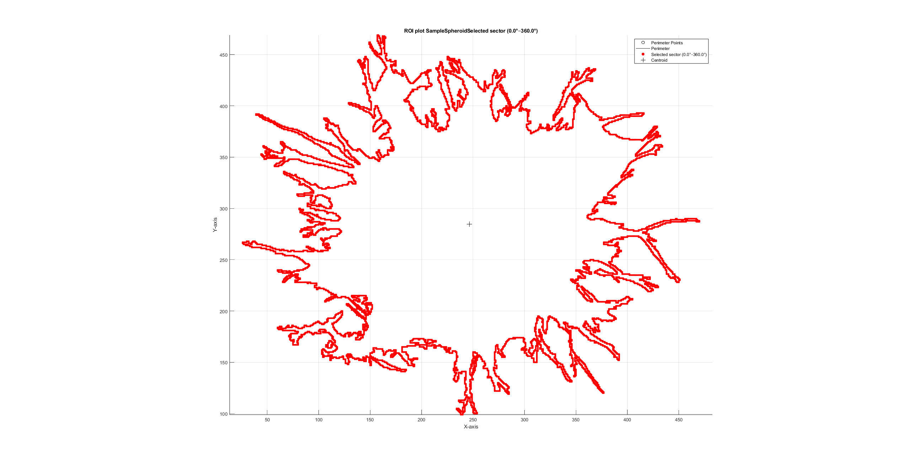
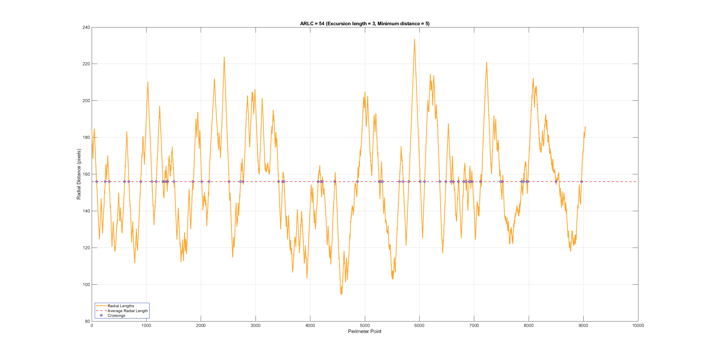

# Calculating the number of Average Radial Length Crossings (ARLC) 
This README file provides documentation pertaining to the script `AverageRadialLengthCrossings.m` developed for shape factor analysis of spheroids and organoids in the manuscript [**“Shape Factor Analysis as a Quantitative Framework for Assessing Spheroid and Organoid Morphology and Invasiveness”**](https://www.biorxiv.org/content/10.64898/2026.03.10.710632v1.full.pdf+html). This analysis was inspired by radial length crossing metrics proposed by [Kilday *et. al.*](https://pubmed.ncbi.nlm.nih.gov/18218460/) for mammagram analysis applications. Scripts were developed in MATLAB version R2023B-R2024B with Image Processing Toolbox Version 23.2-24.2. 

The ARLC analysis requires scripts `ReadImageJROI.m` and `ROIs2Regions.m` adapted from Dylan Muir in the following fork https://github.com/BrittanySchutrum/ReadImageJROI.  

Code DOI: 10.5281/zenodo.18880960

## Contents 
* [Introduction and Background](#introduction-and-background)
  - [Average Radial Length Crossings](#average-radial-length-crossings)
  - [Determining an ARLC with different sensitivities](#determining-an-arlc-with-different-sensitivities)
  - [Finding ARLC Inflection Points Using Linear Interpolation](#finding-arlc-inflection-points-using-linear-interpolation)
  - [Segment Analysis vs. Full Shape Analysis](#segment-analysis-vs.-full-shape-analysis)
* [Usage](#usage)
* [Inputs](#inputs)
* [Functions](#functions)
* [Outputs](#outputs)
  - [sample output results](#figure-1)
  - [results](#results)
* [Related Works](#related-works)
* [Contact](#author-contact-information)
  

## Introduction and Background 

### Average Radial Length Crossings 
Here, the radial length is defined as the Euclidian distance from the centroid to each perimeter point. 

$$\text{radial length}_i=\sqrt{(x_i-x_{\text{centroid}})^2+(y_i-y_{\text{centroid}})^2}$$

The average of all radial lengths is used as the crossing threshold (Average Radial Length).

### Determining an ARLC with different sensitivities
There are two parameters than can be adjusted to optimize the signal to noise ratio of your data set 
1. **Excursion Length** = number of points that need to consecutively fall to one side of the average
2. **Minimum Crossing Distance** = minimim distance between the radial length and the aveage radial length

  

### Finding ARLC Inflection Points Using Linear Interpolation 
Because our perimeter points are discrete data, our inflection points may occur on the graph at values between perimeter points. To actually find these inflection points, we need to interpolate between the saved inflection indexes.

We assume that the slope is **linear** between the inflection point and the point just before the inflection. A line between two points $(x_0,y_0),(x_1,y_1)$ is given by the following equation,

$$y-y_0=\frac{y_1-y_0}{x_1-x_0}(x-x_0)$$

Where the terms are defined in the code as:

$$
\begin{aligned}
\text{previous point} &= x_0 \\
\text{inflection point} &= x \\
l &= y - y_0 \\
m &= x_1 - x_0 \\
n &= y_1 - y_0
\end{aligned}
$$

Solving for the inflection point $x$, this gives us a simplified equation for finding the linear interpolation between the two points,

$$\text{inflection point}=\frac{lm}{n}+\text{previous point}$$

### Segment Analysis vs. full shape analysis 
This code is developed to allow for analysis of the whole shape or only a defined angular "slice"/segment. 0 degrees is at 3 o'clock position as the ROI is displayed in MATLAB and the angle increases counterclockwise.
To analyse the whole ROI (all 360 degrees) set the inputs of theta_start to 0 and theta_end to 360 degrees. 

## Usage 
Install **MATLAB** (version R2023B or later recommended), JAVA and add the extension **Image Processing Toolbox** by Mathworks inside MATLAB (Home > Add-Ons > search for "Image Processing Toolbox"). 
### Prerequisite scripts to load FIJI ROIs into MATLAB 
The ALRC analysis requires scripts `ReadImageJROI.m` and `ROIs2Regions.m` adapted from Dylan Muir in the following fork https://github.com/BrittanySchutrum/ReadImageJROI.  These scipts Read an ImageJ ROI into a matlab structure and convert a set of imported ImageJ ROIs into a Matlab regions structure. Download [ReadImageJROI.m](https://github.com/BrittanySchutrum/ReadImageJROI/blob/master/ReadImageJROI.m) and [ROIs2Regions.m](https://github.com/BrittanySchutrum/ReadImageJROI/blob/master/ROIs2Regions.m) as well as [AverageRadialLengthCrossings.m](https://github.com/BrittanySchutrum/AverageRadialLegnth-Spheroids/blob/main/AverageRadialLengthCrossings.m)

### Average Radial Length Crossing Analysis 
Once you have prepared your software, put the following 3 files into **the directory you are working from**:

* [AverageRadialLengthCrossings.m](https://github.com/BrittanySchutrum/AverageRadialLegnth-Spheroids/blob/main/AverageRadialLengthCrossings.m)
* [ReadImageJROI.m](https://github.com/BrittanySchutrum/ReadImageJROI/blob/master/ReadImageJROI.m)
* [ROIs2Regions.m](https://github.com/BrittanySchutrum/ReadImageJROI/blob/master/ROIs2Regions.m)

To use the code you only need to *open* `AverageRadialLengthCrossings.m`. ReadImageJROI.m and ROIs2Regions.m do not need to be open but must be in the same directory (folder) as `AverageRadialLengthCrossings.m`

Date of data creation: Imaging data used for code development was collected in 2019 with study results published in 2020 [Ling,L et.al. Avannced Functional Materials 2020](https://advanced.onlinelibrary.wiley.com/doi/full/10.1002/adfm.201910650). ROIs generated from these data sets for the nwe analysis were created in 2025. All Digiatal Phantoms generated 2024-2026. 

## Inputs 
1. ROI file (.roi file type) from FIJI
2. mimnimim excursion length in pixels = number of points that need to consecutively fall to one side of the average
3. minimim crossing distance in pixels = minimim distance between the radial length and the aveage radial length
4. theta_start = start of the angle segment to be analyzed (0 degrees = 3 o'clock, angles increase counter clockwise)
5. theta_end = end of the angle segment to be analyzed

## Functions 
### radiallengths() 
radiallengths(inputroi, [2048, 2048], theta_start, theta_end) -> Imports ROI into Matlab, calculates radial length to each perimeter point and creates the  [radialdistance_section] vector, plots the perimeter points of the ImageJ ROI with centroid in MATLAB coordinates (figure 1) % by default the pixel dimentions are defined as 2048x2048. The number does not matter unless your ROI is bigger than these dimensions in pixels

### plot_intersections () 
plot_intersections(radiallengths_section,excursion_length,minimum_distance) -> Plots the radial lengths and determines sustained crossings defined by the excursion length and minimum crossing distance(figure 2) Printed Quantitative Outputs = 1) number of Average Radial Length Crossing (ARLC) and 2) the Standard Deviation of the Radial Length (SDRL)

## Outputs
The following are example ouputs from SampleSpheroid.roi with an excursion length of 3 and minimim crossing distance of 5 
### Figure 1 

  

Figure 1: Plot of the imported ROI in MATLAB. The centroid is plotted as +.  Each perimeter point is a black outlined circle with points that are included in the selected segment filled with red. Here the entire spheroid was analyzed with `theta_start = 0` and `theta_end=360`. 
Please note that due to differences in the coordinate systems used by FIJI and MATLAB, the *ROIs will appear reflected over the X axis (upsidown)* compared to their original orienation in FIJI

### Figure 2 

  

Figure 2: Radial Length plot of SampleSpheroid.roi. X-axis = perimeter points, y-axis = radial length (pixels), orange = radial lengths, magenta dotted line = the average radial length , purple points = valid average radial length crossings
### Results 
The script will print the number of average radial length crossings and the standard deviation of radial lengths 

## Authors
Primary code development: Brittany Schutrum, Jenny Deng, Amalie Gao, Emily Hur, Ju Hee Kim

Cornell University Meinig School of Biomedical Engineering

## Author Contact Information 
### Brittany Schutrum 
**ORCID**: [0000-0002-4462-7812](https://orcid.org/0000-0002-4462-7812) 
**Institution**: Cornell University 
**Emial**: bs773(at)cornell.edu

### Claudia Fischbach 
**ORCID**: [0000-0002-9368-0150](https://orcid.org/0000-0002-9368-0150) 
**Institution**: Cornell University 
**Emial**: cf99(at)cornell.edu

## Related Works
Please view our preprint for applications of average radial length analysis [**“Shape Factor Analysis as a Quantitative Framework for Assessing Spheroid and Organoid Morphology and Invasiveness”**](https://www.biorxiv.org/content/10.64898/2026.03.10.710632v1.full.pdf+html)

Several ROI preperation steps may be useful before using this ARLC MATLAB script. Please refer to 'interpolation.ijm' and 'perimeter_points.ijm' located in the [companion repository](https://github.com/BrittanySchutrum/FIJI-Spheroid-Morphological-Signatures) 

`ReadImageJROI.m` and `ROIs2Regions.m` were adapted from Dylan Muir [https://github.com/DylanMuir/ReadImageJROI/tree/maste](https://github.com/DylanMuir/ReadImageJROI/tree/master). With this orgininal work published in Frontiers in Neuroinformatics: DR Muir and BM Kampa. 2014. [FocusStack and StimServer: A new open source MATLAB toolchain for visual stimulation and analysis of two-photon calcium neuronal imaging data](https://www.frontiersin.org/journals/neuroinformatics/articles/10.3389/fninf.2014.00085/full), Frontiers in Neuroinformatics. 
